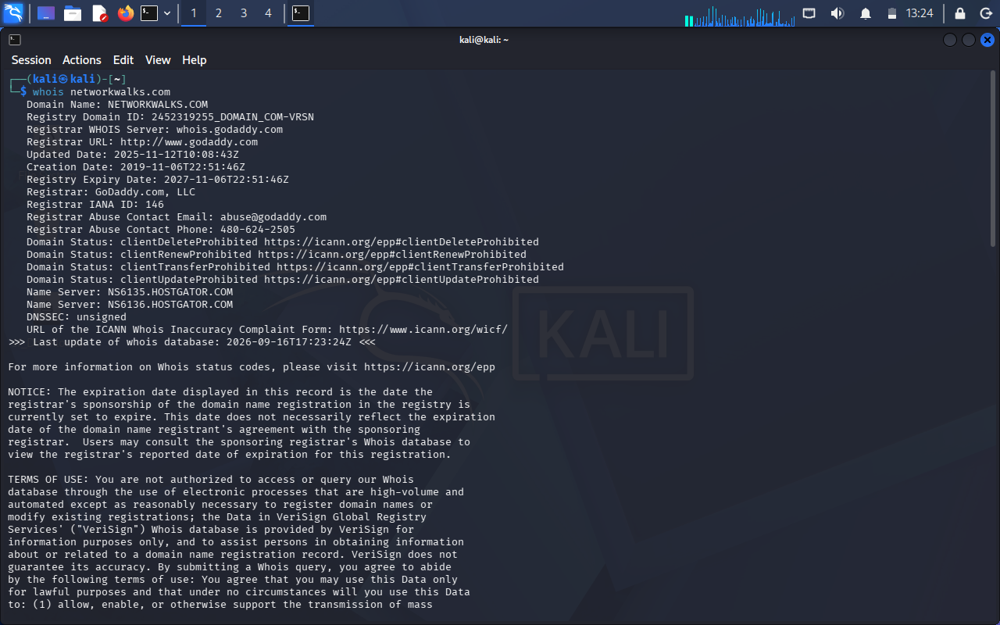
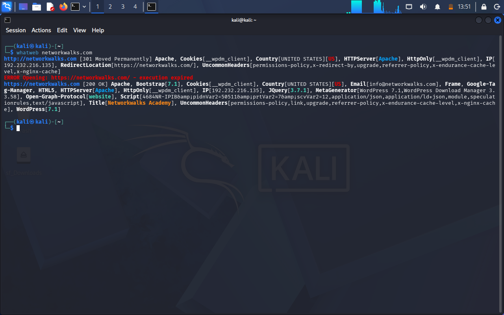
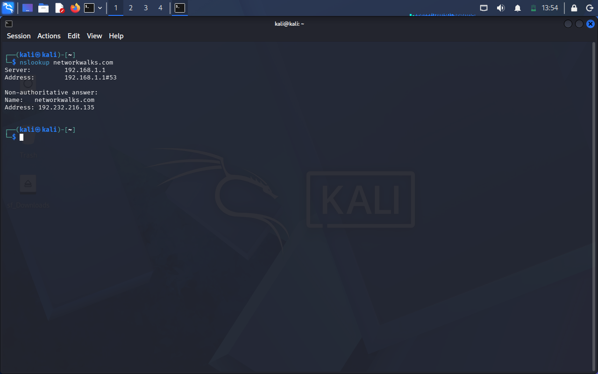
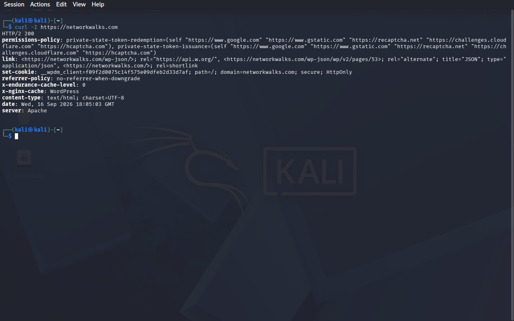
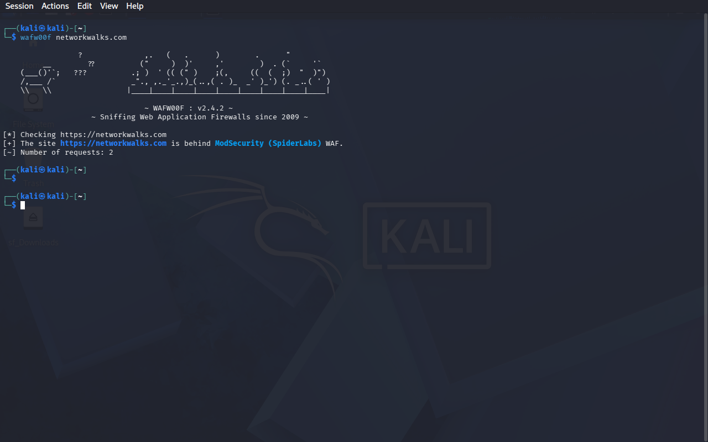
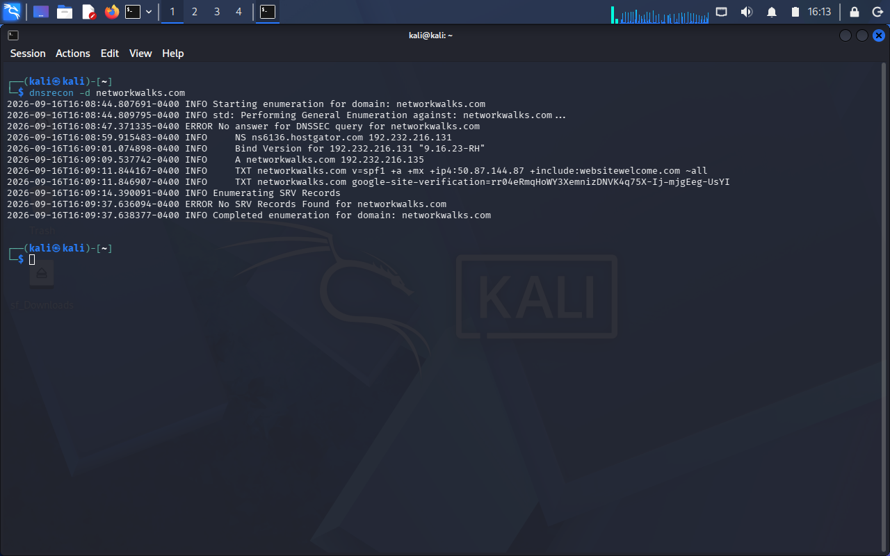
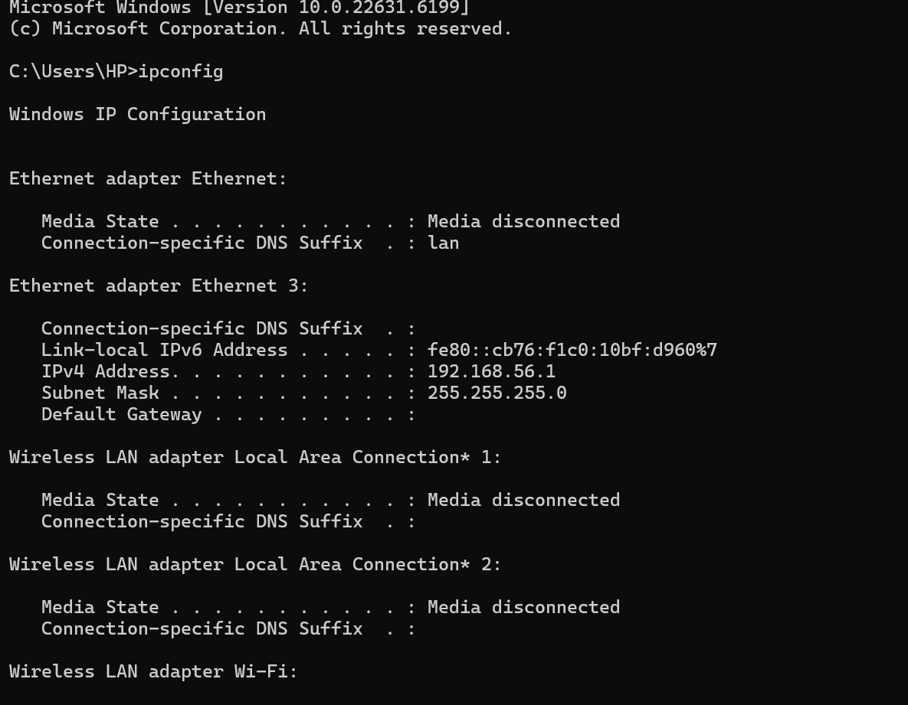
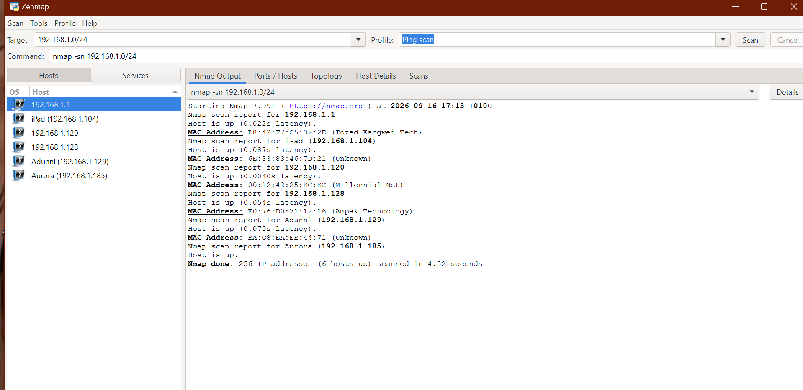
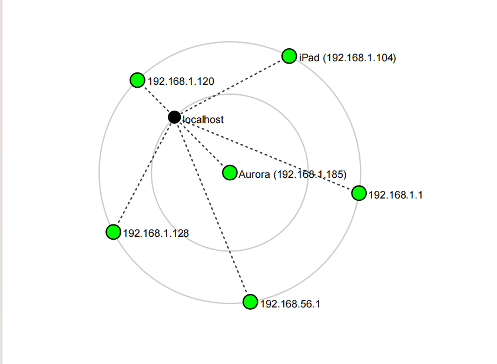

# 🔐 Cybersecurity — Footprinting & Network Scanning

### Week 2 Practical Project | Networkwalks B083

> **A hands-on reconnaissance and network discovery exercise using Kali Linux, Nmap, and Zenmap.**

---

## 📌 Project Overview

As part of Week 2 of my **Cybersecurity & Ethical Hacking internship with Networkwalks**, I worked on two important areas of cybersecurity:

* 🔎 **Footprinting & Reconnaissance** using Kali Linux
* 🌐 **Network Scanning & Host Discovery** using Zenmap/Nmap

The footprinting phase focused on gathering publicly available information about the authorized **networkwalks.com** domain using different reconnaissance tools.

The network scanning phase involved scanning my own local LAN using Zenmap to identify the local network configuration, discover live hosts, identify IP and MAC addresses, and visualize the network topology.

This project helped me understand how reconnaissance and network discovery can be used as early stages of an authorized security assessment.

---

## ⚠️ Disclaimer

All activities documented in this project were performed within an authorized educational scope.

The footprinting exercise was performed against the authorized **Networkwalks** target, while the network scanning exercise was performed on my **own local LAN network**.

These techniques should only be used against systems and networks where appropriate authorization has been obtained.

No exploitation or unauthorized access was performed during this project.

---

## 🎯 Objectives

The objectives of this practical were to:

* Understand the purpose of footprinting and reconnaissance.
* Gather domain registration information using WHOIS.
* Identify web technologies using WhatWeb.
* Resolve a domain to its IP address using Nslookup.
* Inspect HTTP response headers using Curl.
* Detect possible Web Application Firewall protection using Wafw00f.
* Enumerate DNS records using DNSRecon.
* Identify my local IP address and LAN subnet.
* Discover live hosts within my local network using Zenmap.
* Identify the IP and MAC addresses of discovered hosts.
* Generate a network topology.
* Document cybersecurity activities and findings professionally.

---

# 🛠️ Tools & Technologies

| Tool              | Purpose                                         |
| ----------------- | ----------------------------------------------- |
| 🐉 **Kali Linux** | Reconnaissance and security testing environment |
| **WHOIS**         | Domain registration information                 |
| **WhatWeb**       | Web technology fingerprinting                   |
| **Nslookup**      | DNS and IP resolution                           |
| **Curl**          | HTTP response header inspection                 |
| **Wafw00f**       | Web Application Firewall detection              |
| **DNSRecon**      | DNS record enumeration                          |
| **Nmap**          | Network scanning                                |
| **Zenmap**        | Graphical interface for Nmap                    |
| **Windows CMD**   | Local network configuration                     |

---

# 🔎 Part 1 — Footprinting & Reconnaissance

## Target

**Domain:** `networkwalks.com`

The following tools were used to collect different types of publicly available information:

1. WHOIS
2. WhatWeb
3. Nslookup
4. Curl
5. Wafw00f
6. DNSRecon

---

## 1. WHOIS — Domain Registration Information

### 🎯 Objective

To obtain publicly available registration information associated with the target domain.

### 💻 Command

```bash
whois networkwalks.com
```

### 📋 Result

The WHOIS lookup provided information relating to the domain registration and name servers.

**Key findings:**

* **Registrar:** `GoDaddy.com, LLC`
* **Registration Date:** `2019-11-06T22:51:46Z`
* **Expiry Date:** `2027-11-06T22:51:46Z`
* **Name Servers:** `NS6135.HOSTGATOR.COM`

### 📸 Evidence



### 💡 Observation

WHOIS provided publicly available information about the domain and some of the infrastructure associated with it. This demonstrates how domain registration information can contribute to the initial reconnaissance stage of a security assessment.

---

## 2. WhatWeb — Web Technology Fingerprinting

### 🎯 Objective

To identify technologies and software being used by the target website.

### 💻 Command

```bash
whatweb networkwalks.com
```

### 📋 Result

WhatWeb identified several technologies associated with the website.

**Key findings included:**

* **WordPress:** `7.0.4`
* **WP Download Manager:** `3.3.58`

### 📸 Evidence



### 💡 Observation

WhatWeb helped me identify technologies exposed by the website. Technology fingerprinting can provide useful information during the reconnaissance stage and help a security professional understand the technologies present before conducting further authorized testing.

---

## 3. Nslookup — DNS Resolution

### 🎯 Objective

To resolve the target domain name to its associated IP address.

### 💻 Command

```bash
nslookup networkwalks.com
```

### 📋 Result

**Domain:** `networkwalks.com`

**IP Address:** `192.232.216.135`


### 📸 Evidence



### 💡 Observation

Nslookup successfully resolved the domain name to an IP address. This demonstrates how DNS information can be used to identify the network address associated with a domain.

---

## 4. Curl — HTTP Response Headers

### 🎯 Objective

To inspect the HTTP response headers returned by the target website.

### 💻 Command

```bash
curl -I https://networkwalks.com
```

### 📋 Result

The HTTP response provided additional technical information about the web application.

### 📸 Evidence



### 💡 Observation

Using Curl with the `-I` option allowed me to examine the HTTP response headers without retrieving the full webpage. The headers provided additional technical information about the web application.

---

## 5. Wafw00f — Web Application Firewall Detection

### 🎯 Objective

To determine whether a Web Application Firewall was detected on the target website.

### 💻 Command

```bash
wafw00f https://networkwalks.com
```

### 📋 Result

**WAF Detected:** Yes

**WAF Identified:** `ModSecurity (SpiderLabs)`

### 📸 Evidence



### 💡 Observation

Wafw00f identified **ModSecurity (SpiderLabs)** as the Web Application Firewall.

This provided information about a security technology deployed in front of the web application. The detection of a WAF does not by itself confirm how effective the protection is.

---

## 6. DNSRecon — DNS Record Enumeration

### 🎯 Objective

To gather additional DNS information associated with the target domain.

### 💻 Command

```bash
dnsrecon -d networkwalks.com
```

### 📋 Result

DNSRecon returned information relating to the domain's DNS configuration.

### 📸 Evidence

**Evidence:**



### 💡 Observation

DNSRecon provided additional information about the domain's DNS infrastructure. DNS records can help security professionals build a broader understanding of publicly accessible infrastructure.

---

# 🌐 Part 2 — Network Scanning with Zenmap

The second part of the practical involved discovering active devices on my own local network using **Zenmap**, the graphical interface for Nmap.

---

## 1. Installing Zenmap

### 🎯 Objective

To install Zenmap on my Windows PC for network discovery and scanning.

### 📋 Procedure

I downloaded and installed Zenmap from the official Nmap website.

**Zenmap Version:** `7.991`

### 💡 Observation

Zenmap provides a graphical interface for Nmap, allowing network scans to be configured and their results to be viewed more easily.

---

## 2. Identifying My Local IP & LAN Subnet

### 🎯 Objective

To identify the local IP address and determine the subnet of my LAN.

### 💻 Command

```cmd
ipconfig
```

or

```cmd
ipconfig /all
```

### 📸 Evidence



### 💡 Observation

The `ipconfig` command provided the network configuration of my Windows PC. I used the IPv4 address and subnet information to determine the network range that would be scanned using Zenmap.

---

## 3. Discovering Live Hosts

### 🎯 Objective

To identify active devices within my local subnet.

### ⚙️ Zenmap Configuration

**Target:** `192.168.1.0/24`

**Scan Profile:** `Ping Scan`

### 📋 Result

The Zenmap scan identified **6 live hosts** on my local network. The scan also provided MAC address information for the hosts where it was available. MAC addresses can provide additional information for identifying devices on a local network.

| No. | IP Address    | Status  |
| --: | ------------- | ------- |
|   1 | `192.168.1.1` | 🟢 Live |
|   2 | `192.168.1.104` | 🟢 Live |
|   3 | `192.168.1.120` | 🟢 Live |
|   4 | `192.168.1.128` | 🟢 Live |
|   5 | `192.168.1.129` | 🟢 Live |
|   6 | `192.168.1.185` | 🟢 Live |

### 📸 Evidence



---

# 🗺️ 4. Network Topology

### 🎯 Objective

To create a visual representation of the devices discovered during the network scan.

### 📋 Procedure

After completing the scan, I opened the **Topology** section in Zenmap and reviewed the discovered hosts.

I configured the topology view and saved the resulting network topology in **PDF format** as required by the practical.

### 📸 Evidence



### 📄 Topology PDF

[📄 View Network Topology PDF](network_topology_pdf.pdf)

### 💡 Observation

The topology view provided a visual representation of the discovered hosts and helped me understand how network discovery can be used to map devices within a local network.

---

# 📊 Findings & Risk Analysis

The following are observations made during the footprinting and network scanning activities.

|  # | Finding                        | Evidence | Security Relevance                                                | Risk       |
| -: | ------------------------------ | -------- | ----------------------------------------------------------------- | ---------- |
|  1 | Web technologies identified    | WhatWeb  | Technology information may assist further authorized enumeration  | **MEDIUM** |
|  2 | Domain IP address identified   | Nslookup | Provides information about the web service's network location     | **LOW**    |
|  3 | HTTP headers exposed           | Curl     | May reveal technical information about the web server/application | **LOW**    |
|  4 | WAF identified                 | Wafw00f  | Provides information about deployed security infrastructure       | **LOW**    |
|  5 | DNS records exposed            | DNSRecon | Can help build a profile of publicly accessible infrastructure    | **MEDIUM** |
|  6 | Multiple live hosts discovered | Zenmap   | Unexpected devices may require investigation                      | **MEDIUM** |

> **Note:** These findings are observations from reconnaissance and network discovery activities. They do not automatically represent confirmed vulnerabilities.

No exploitation or vulnerability validation was performed during this project.

---

# 🛡️ Recommendations

Based on the observations from the practical, the following security practices are recommended:

### 1. Review Publicly Exposed Information

Organizations should regularly review information that can be obtained about their domains, websites, technologies, and infrastructure through reconnaissance techniques.

### 2. Keep Web Technologies Updated

Web servers, CMS platforms, plugins, frameworks, and other technologies should be kept updated and reviewed for known security issues.

### 3. Review HTTP Headers

HTTP response headers should be reviewed to determine whether unnecessary technical information is being exposed.

### 4. Review DNS Records

DNS records should be reviewed periodically to ensure that only necessary services and information are publicly exposed.

### 5. Maintain WAF Configuration

Where a Web Application Firewall is deployed, it should be properly configured, monitored, and maintained.

### 6. Perform Regular Network Discovery

Organizations should periodically perform authorized network discovery to maintain an accurate understanding of active devices within their environment.

### 7. Investigate Unknown Devices

Unexpected devices identified during network scanning should be verified and investigated.

### 8. Maintain Network Documentation

Network addresses, devices, and topology information should be properly documented and kept up to date.

### 9. Maintain Proper Authorization

Reconnaissance and scanning should only be performed against systems and networks where appropriate authorization has been obtained.

---

# 🧠 What I Learned

This practical gave me hands-on experience with different reconnaissance and network discovery techniques.

I learned how **WHOIS** can be used to gather domain registration information and how **WhatWeb** can identify technologies associated with a website.

I also learned how **Nslookup** can resolve domain names to IP addresses and how **Curl** can be used to inspect HTTP response headers.

Using **Wafw00f**, I learned how to identify possible Web Application Firewall technologies, while **DNSRecon** helped me understand how DNS records can reveal additional information about an organization's infrastructure.

For the network scanning section, I learned how to identify my local IP address and subnet using Windows CMD and how to use **Zenmap/Nmap** to discover active hosts.

I also gained experience identifying IP and MAC addresses and using Zenmap's topology feature to visualize discovered devices.

Overall, this project helped me understand that reconnaissance is an important early stage of cybersecurity assessment. It also taught me the importance of documenting commands, results, screenshots, observations, and security relevance clearly.

---

# ✅ Project Summary

| Category                  | Details                                           |
| ------------------------- | ------------------------------------------------- |
| **Program**               | Cybersecurity & Ethical Hacking Internship        |
| **Organization**          | Networkwalks                                      |
| **Batch**                 | B083                                              |
| **Week**                  | 2                                                 |
| **Project**               | Footprinting & Network Scanning                   |
| **Footprinting Platform** | Kali Linux                                        |
| **Scanning Platform**     | Windows                                           |
| **Reconnaissance Tools**  | WHOIS, WhatWeb, Nslookup, Curl, Wafw00f, DNSRecon |
| **Scanning Tools**        | Nmap / Zenmap                                     |
| **Live Hosts Discovered** | 6                                                 |
| **Target**                | networkwalks.com + Own Local LAN                  |
| **Authorization**         | Yes                                               |

---

# 📸 Evidence

Screenshots and supporting evidence for the practical are included throughout this documentation.


# 👤 Author

**Tijani Ayomide**

Cybersecurity Intern
**Networkwalks — Batch B083**

---

## 📚 Project Information

**Week:** 2
**Modules:** W2-PM1 & W2-PM5
**Focus:** Footprinting, Reconnaissance, Network Scanning & Host Discovery
**Status:** Completed ✅
